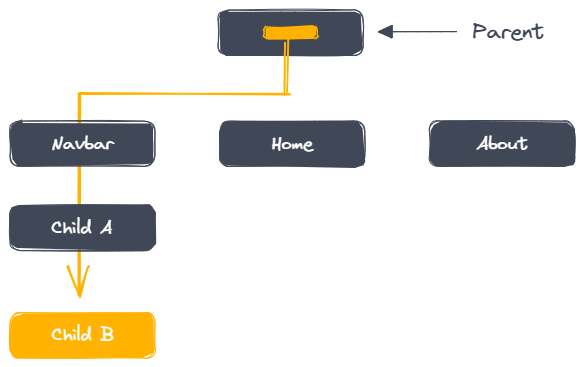
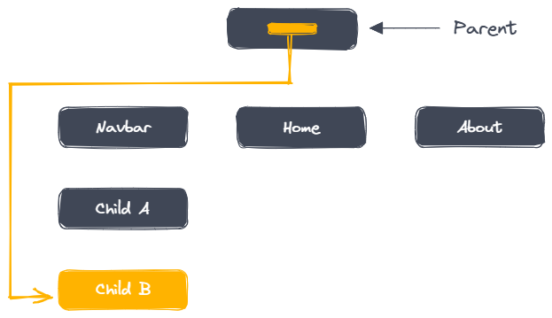

# What you know about Props and State

Props and state are both plain javascript or Js objects. While both props and state influence the render output, they are different in one important way props get passed to the component like parameters in a function where state is managed within the component like variables declared within a function.

Props and state are fundamental concepts in React that are used to manage data within and between components. Here's a breakdown of what each one is and how they differ:

## Props

- Purpose: Pass data down from parent components to child components.
- Think of it as: Instructions or arguments passed to a function.
- Read-only: Props cannot be modified by the child component that receives them.
- Origin: Set by the parent component when rendering the child component.
- Example: Imagine a "ProductCard" component that displays a product's name and price. The parent component would provide these values as props to the "ProductCard".

## State

- Purpose: Manage data within a component that can change over time.
- Think of it as: The component's internal memory.
- Mutable: The state can be updated by the component itself using the setState method.
- Origin: Initialized within the component itself, but can also receive initial values from props.
- Example: A counter component might use state to track the current count, and update it when a button is clicked.

## How to Use the React Context API in Your Projects

Managing state is an essential part of developing applications in React. A common way to manage state is by passing props. Passing props means sending data from one component to another. It's a good way to make sure that data gets to the right place in a React application.

But it can be annoying to pass props when you have to send the same data to lots of components or when components are far away from each other. This can make an application slower and harder to work with.

Fortunately, React provides a built-in feature known as the context API that helps “teleport” data to the components that need it without passing props.

In this article, we'll explore how the context API works and how to use it effectively in your React applications.

## The Problem with Passing Props

In React, passing props is a fundamental concept that enables a parent component to share data with its child components as well as other components within an application.

In many cases, passing props can be an effective way to share data between different parts of your application. But passing props down a chain of multiple components to reach a specific component can make your code overly cumbersome.



> Illustration of passing props from parent to children

From the above diagram, to pass data down to the component "Child B", we need to pass it down through all the intermediate components, even if those components don't actually use the data themselves. This is what is referred to as "prop drilling."

Prop drilling can make your code more difficult to read and maintain, and can also make it harder to refactor your components later on.

This is where the Context API comes in. With Context API, you can store data at the top level of the component tree and make it available to all other components that need it without passing props.

## How the Context API Works

Context API allows data to be passed through a component tree without having to pass props manually at every level. This makes it easier to share data between components.



> A diagram illustrating how Context API works

For example, let’s say you have a shopping app with a component that shows a user’s shopping cart, and another component that shows the user’s order history.

With Context API, you can create a “context” that holds the user’s shopping information, like their cart and order history. Then, you can use that context in both the shopping cart and the order history component, without having to pass the information down through props.

It’s like having a big box that holds all the things you need for your shopping trip. You can take things out of the box when you need them, and put them back in when you’re done.

Basically, Context API consists of two main components: the context provider and the context consumer. The provider is responsible for creating and managing the context, which holds the data to be shared between components. On the other hand, the consumer is used to access the context and its data from within a component.

In the example given, the provider will create the context that holds the user's shopping information, while the consumer components (shopping cart and order history) will access that context to retrieve the data they need. This avoids the need to pass the information down through props, making your code more efficient and easier to manage.

## How to Get Started with the Context API

To start using the Context API in your applications, you'll need to follow a few simple steps:

## Create a Context Object

First, you need to create a context object using the createContext function from the 'react' library. This context object will hold the data that you want to share across your application.

Create a new file named MyContext.js in the src folder and add the following code to create a context object:

```js
import { createContext } from "react";

export const MyContext = createContext("");
```

In the above code, we're importing createContext from React and using it to create a new context object named "MyContext". Then, we are exporting the context object so that we can use it in other parts of our application.

## Wrap Components with a Provider

Once you've created a context object, you need to wrap the components that need access to the shared data with a Provider component. The Provider component accepts a "value" prop that holds the shared data, and any component that is a child of the Provider component can access that shared data.

It's important to note that the Provider component should be wrapped around the top-level component in an application to ensure that all child components have access to the shared data.

Here's an example that demonstrates how to wrap components with a Provider in Context API:

```js
// Create a parent component that wraps child components with a Provider

import { useState, React } from "react";
import { MyContext } from "./MyContext";
import MyComponent from "./MyComponent";

function App() {
  const [text, setText] = useState("");

  return (
    <div>
      <MyContext.Provider value={{ text, setText }}>
        <MyComponent />
      </MyContext.Provider>
    </div>
  );
}

export default App;
```

In this example, we have a parent component called App. This component has a state variable called "text", which is initially set to an empty string. We've also defined a function called setText that can be used to update the value of text.

Inside the return statement of the App component, we've wrapped the children of this component with the provider component ("MyContext.Provider"). Then we've passed an object to the value prop of the provider component that contains "text" and "setText" values.

## Consume the Context

Now that we've created the provider component, we need to consume the context in other components. To do this, we use the "useContext" hook from React.

```js
import { useContext } from "react";
import { MyContext } from "./MyContext";

function MyComponent() {
  const { text, setText } = useContext(MyContext);

  return (
    <div>
      <h1>{text}</h1>
      <button onClick={() => setText("Hello, world!")}>Click me</button>
    </div>
  );
}

export default MyComponent;
```

And that's it! This is how you can use the Context API in your React application.

By creating a context object, defining a provider component, and consuming the context in other components, you can share data across your application in a simple and efficient way.

## Use Cases of Context API

Here are some real-world use cases of Context API.

- Theming: You can use Context API to store the current theme of your application and make it available to all components. This way, whenever the user switches the theme (such as enabling dark mode), all components will be updated with the new theme.

- User Authentication: You can also use Context API to store a user's authentication status and pass it down to all the components that need it. This way, you can easily restrict access to certain parts of your application based on the user's authentication status.

- Multilingual Support: You can store the current language of your application in the context and pass it down to all the components that need it. This way, you can easily switch between different languages without having to pass the language down as props to all the components.

- Accessing data from external sources: Finally, you can use the Context API to store data retrieved from external sources such as APIs or databases and make it available to all components. This can simplify your code and make it easier to manage data across your application.

Overall, Context API provides a flexible and efficient way to manage state data across your application, and it can be particularly useful for managing global data that needs to be shared between multiple components.

## Best Practices for Context API

As with any tool, there are best practices and common pitfalls to keep in mind when using the Context API in your projects. Here are some tips for effective use of the Context API:

- Use a separate file to define your Context: It's a good practice to define your context object in a separate file to keep your code organized and easy to maintain.

- Keep Context API limited to global state management only: It's best to use the Context API for managing state that needs to be accessed across multiple components in your application. Avoid using it for state that only needs to be accessed within a single component, as it can lead to unnecessary complexity and performance issues.

- Use context providers sparingly: While context providers can be a powerful tool for managing global state, it's generally a good idea to use them sparingly. Instead, consider using props to pass data down through your component tree whenever possible.

-Use default values: When creating a new context, it's a good idea to provide a default value that will be used if no provider is present. This can help prevent unexpected errors and make your code more robust. Note that, for the project we did above, we used an empty string as the default value for the context object.

## Recap

In this article, we explored the React Context API, a powerful tool for managing state in React applications.

We have walked through the basics of the Context API, including creating a context, creating a Provider component to pass data to child components, and consuming data in other component using the useContext hook.

## Conclusion

If you're interested in exploring how to implement a light/dark mode theme in your own React projects using the Context API, I've created a simple website that demonstrates how to do just that. You can find the code for the project on my GitHub.

By exploring the code and experimenting with your own modifications, you'll be well on your way to mastering the Context API and unlocking its full potential in your own projects.
